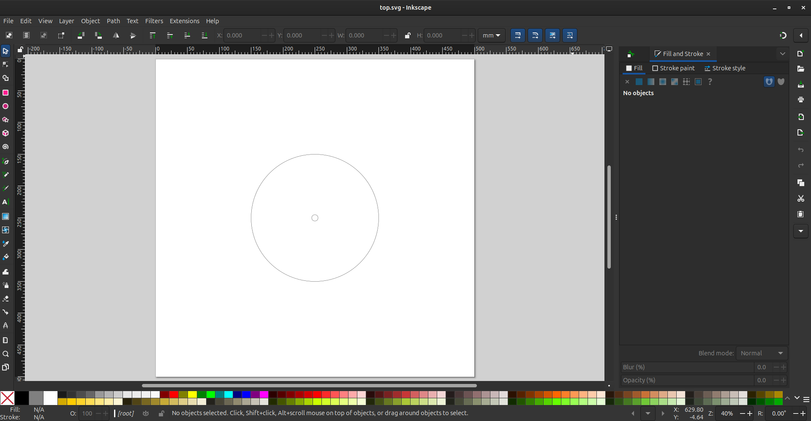
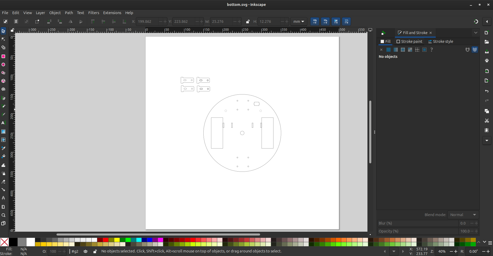
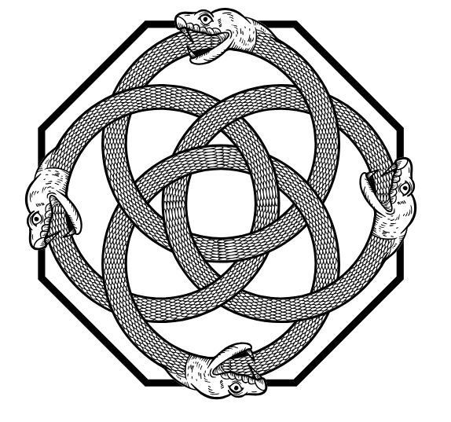
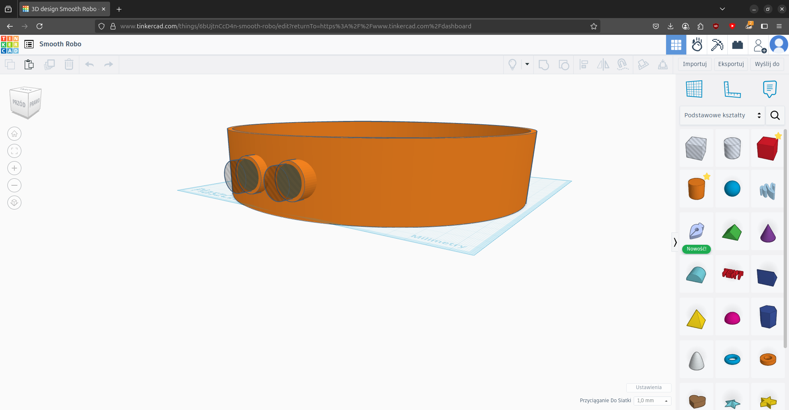

# 🤖 CircularChassis2WD – Podwozie robota z grawerem

Witam w projekcie **CircularChassis2WD**! To podwozie robota 2WD zostało zaprojektowane z myślą o łatwej produkcji i efektownym wyglądzie. Łączy w sobie elementy wycinane laserowo z grawerem oraz ścianki do druku 3D. Idealne do nauki, prototypowania i własnych konstrukcji robotycznych!  
&nbsp;

---

## 📦 Zawartość repozytorium

```
.
├── bottom.svg         # Plik SVG dolnej płyty podwozia
├── engraver.svg       # Plik SVG z grawerem (ornament)
├── img
│   ├── laser.gif     # Film z procesu wycinania laserowego
|   ├── druk.gif      # Film z procesu druku 3D
│   ├── p1.png         # Wizualizacja projektu 3D (Tinkercad)
│   ├── p2.png         # Grawer (ornament) – podgląd
│   ├── p3.png         # Bottom.svg w Inkscape
│   └── p4.png         # Top.svg w Inkscape
├── readme.md          # Ten plik
├── site.stl           # Obramowanie/ścianki do druku 3D
└── top.svg            # Plik SVG górnej płyty podwozia
```

---

## 🛠️ Opis projektu

- **Konstrukcja:**  
  - Dwie płyty (górna i dolna) wycinane z tworzywa na laserze CNC na podstawie plików SVG.
  - Na górnej płycie znajduje się efektowny grawer w stylu celtyckiego węzła (ouroboros).
  - Ścianki boczne (obramowanie) zaprojektowane w Tinkercad – plik STL gotowy do druku 3D.

- **Pliki graficzne:**  
  - SVG do wycinania laserowego (top.svg, bottom.svg)
  - SVG z grawerem (engraver.svg)
  - STL do druku 3D (site.stl)


- **Galeria:**  

  
*Górna płyta (top.svg) w Inkscape*

  
*Dolna płyta (bottom.svg) w Inkscape*

  
*Grawer (ornament) – podgląd*

  
*Wizualizacja projektu 3D w Tinkercad*

---

## 🎥 Prezentacja

- Zobacz film z procesu grawerowania laserowego:  


- Zobacz film z procesu druku 3D:


---

## 🧩 Wymagania

- Oprogramowanie do obsługi plików SVG (np. Inkscape)
- Drukarka 3D (obsługa STL)
- Laser CNC do cięcia i grawerowania

---

## 💡 Inspiracja

Projekt inspirowany motywami celtyckimi i symboliką ouroboros, co nadaje robotowi unikalny, dekoracyjny wygląd.

---


## 🏁 Miłego składania i eksperymentowania! 🚗✨

